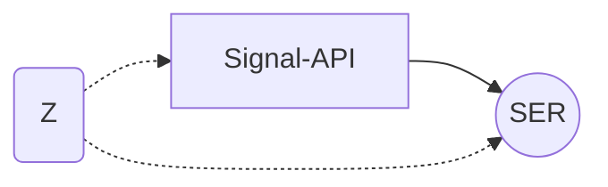
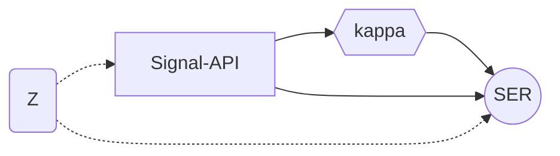

# Phase B Demo — Four end-to-end causal flows

> Plan v2 §7 #11 deliverable: real-BOS-question end-to-end via the
> BOS Agent. This document captures the 4 causal intent paths
> (`causal.ate` / `causal.mediation` / `causal.sensitivity` /
> `causal.full`), shows the operator message, the agent's intent
> classification, the state transitions across the 5 LangGraph
> causal nodes, and the final markdown report shape. Numbers are
> illustrative (drawn from B2a-B2b.3 unit-test fixtures); a live
> Anthropic API key + a running backend would produce real values
> on the same shape.

## Setup

Two services run side-by-side on the author machine:

```
$ uvicorn app.main:app --port 8000 --reload   # BOS Core
$ python -m agent.main --port 8001 --reload   # BOS Agent
```

Default Anthropic config (`backend/agent/llm.py`):

```
LLM_PROVIDER=anthropic
LLM_MODEL_ROUTER=claude-sonnet-4-5
LLM_MODEL_RENDER=claude-sonnet-4-5
ANTHROPIC_API_KEY=<env>
```

For demos without an API key, set `AGENT_ROUTER_USE_LLM=0` — the
keyword-fallback router classifies the four causal intents from
their keyword tables (see `nodes/router.py::_KEYWORDS`). The
graph-boot tests run in this mode.

## Demo 1 — `causal.ate` (single ATE + refute)

### Operator question

> "What is the ATE of Signal-API on SER given the Z-confound DAG?"

### Routing

`router_node` sees the keyword `ATE` (`\bate\b` word-boundary
match against `causal.ate`'s keyword tuple) and emits
`state.intent = "causal.ate"`.

### State trajectory

```
1. router_node
   -> state.intent = "causal.ate"

2. causal_identify_node
   POST /api/v1/causal/identify
       request: dag + treatment="Signal-API" + outcome="SER" + dataset_fingerprint
   <- CausalIdentifyResponse(strategy="backdoor",
                             adjustment_set=["Z"],
                             estimand_handle=<IdentifiedEstimandHandle>,
                             evidence_level="supported")
   state.causal.identify_result = <response>
   state.tool_calls += [ToolCallRecord(tool="causal_identify", status="ok")]

3. _check_causal_errors_after_identify -> "causal_estimate"

4. causal_estimate_node
   POST /api/v1/causal/estimate
       request: dag + treatment + outcome + data +
                method_family="linear_regression" +
                precomputed_estimand=<IdentifiedEstimandHandle>   <- Mod 4 reuse
   <- CausalEstimateResponse(point_estimate=2.0, ci_lower=1.8,
                             ci_upper=2.2, e_value_cheap=3.1,
                             estimate_handle=<EstimateHandle>,
                             evidence_level="supported")
   state.causal.estimate_result = <response>
   state.evidence_level = "supported"
   state.tool_calls += [ToolCallRecord(tool="causal_estimate", status="ok")]

5. _dispatch_after_estimate -> "causal_refute"  (intent=causal.ate)

6. causal_refute_node
   POST /api/v1/causal/refute
       request: estimate_handle + refuters=[<4 mandatory>] +
                original_e_value=3.1
   <- CausalRefuteResponse(refute_results=[<4 RefuterResult>],
                           overall_robust=True,
                           evidence_level="validated",
                           e_value_used=3.1)
   state.causal.refute_result = <response>
   state.evidence_level = "validated"
   state.tool_calls += [ToolCallRecord(tool="causal_refute", status="ok")]

7. render_node
   -> state.report = <markdown below>
```

### Rendered markdown

```
## BOS Agent run summary
- **Intent**: `causal.ate`
- **Evidence level**: `validated`
- **Core calls**: 3 ok / 0 error

### Causal analysis
- **Treatment**: `Signal-API`    **Outcome**: `SER`
- **Identification**: strategy=`backdoor` on adjustment set [Z]
- **ATE**: 2.000    **95% CI**: [1.800, 2.200]
- **E-value (cheap)**: 3.10
- **Refutation**: 4/4 robust    **Overall robust**: True


```

## Demo 2 — `causal.mediation` (parallel refute + mediation)

### Operator question

> "How much of the SER lift came from kappa? Compute proportion mediated."

### Routing

`router_node` matches the keyword `proportion mediated` (against
`causal.mediation`'s tuple). `state.intent = "causal.mediation"`.

### State trajectory

```
1. router_node -> intent = "causal.mediation"

2. causal_identify_node      (POST /causal/identify, same as Demo 1)

3. _check_causal_errors_after_identify -> "causal_estimate"

4. causal_estimate_node      (POST /causal/estimate, same as Demo 1)

5. _dispatch_after_estimate -> "causal_mediation_dispatch"

6. causal_mediation_dispatch_node
   # asyncio.gather(refute, mediation, return_exceptions=True)
   #   ↓ in parallel:
   #
   #   causal_refute_node     -> CausalRefuteResponse(robust=True)
   #   causal_mediation_node  -> CausalMediationResponse(
   #                                proportion_mediated=0.70,
   #                                decomposition=<NDE/NIE/total>)
   _merge_partial_patches merges both patches:
       state.causal.refute_result = <response>
       state.causal.mediation_result = <response>
       state.tool_calls += [<2 ok records>]

7. render_node -> markdown with mediation block + DAG
```

### Rendered markdown (excerpt)

```
### Causal analysis
- **Treatment**: `Signal-API`    **Outcome**: `SER`
- **Identification**: strategy=`backdoor` on adjustment set [Z]
- **ATE**: 1.900    **95% CI**: [1.700, 2.100]
- **E-value (cheap)**: 3.05
- **Refutation**: 4/4 robust    **Overall robust**: True
- **Mediation**: proportion mediated = 0.700    (direct=0.570,
  indirect=1.330, total=1.900)


```

The mediator (`kappa`) renders as a hexagon (`{{name}}`) per the
Plan v2 §3.6 node-shape convention.

## Demo 3 — `causal.sensitivity` (single sensitivity branch)

### Operator question

> "How robust is the ATE estimate to unmeasured confounders?"

### Routing

`router_node` matches `unmeasured` (against `causal.sensitivity`'s
tuple). `state.intent = "causal.sensitivity"`.

### State trajectory

```
1. router_node -> intent = "causal.sensitivity"
2. causal_identify_node          (POST /causal/identify)
3. _check_causal_errors_after_identify -> "causal_estimate"
4. causal_estimate_node          (POST /causal/estimate)
5. _dispatch_after_estimate -> "causal_sensitivity"
6. causal_sensitivity_node       (POST /causal/sensitivity, method="evalue")
   <- CausalSensitivityResponse(
        method="evalue",
        evalue_detail=SensitivityEvalueDetail(
            e_value_point=3.43, e_value_lower_ci=3.24,
            source="dowhy_class"),
        overall_robust=True,
        evidence_level="validated")
7. render_node -> markdown with sensitivity block
```

### Rendered markdown (excerpt)

```
### Causal analysis
- **Treatment**: `Signal-API`    **Outcome**: `SER`
- **ATE**: 2.000    **95% CI**: [1.800, 2.200]
- **Sensitivity** (evalue, src=`dowhy_class`): E-value point=3.43,
  lower-CI=3.24
- **Overall robust** (paper Γ-bound ≥ 1.5): True
```

The Γ-bound 1.5 gate is the paper line-101 falsification
threshold; `e_value_lower_ci > 1.5` so the verdict is `True`.

## Demo 4 — `causal.full` (parallel refute + mediation + sensitivity)

### Operator question

> "Explain in depth the causal story for Signal-API → SER."

### Routing

`router_node` matches `explain in depth` (against `causal.full`'s
tuple). `state.intent = "causal.full"`.

### State trajectory

```
1. router_node -> intent = "causal.full"
2. causal_identify_node
3. _check_causal_errors_after_identify -> "causal_estimate"
4. causal_estimate_node
5. _dispatch_after_estimate -> "causal_fanout_full"
6. causal_fanout_full_node
   # asyncio.gather(refute, mediation, sensitivity,
   #                return_exceptions=True)
   #   3 parallel branches:
   #     causal_refute_node       -> CausalRefuteResponse(robust=True)
   #     causal_mediation_node    -> CausalMediationResponse(pm=0.70)
   #     causal_sensitivity_node  -> CausalSensitivityResponse(robust=True)
   _merge_partial_patches:
       state.causal.refute_result      = <response>
       state.causal.mediation_result   = <response>
       state.causal.sensitivity_result = <response>
       state.tool_calls += [<3 ok records>]
7. render_node -> full causal markdown (all 5 sub-blocks)
```

### Rendered markdown (full)

```
## BOS Agent run summary
- **Intent**: `causal.full`
- **Evidence level**: `validated`
- **Core calls**: 5 ok / 0 error

### Causal analysis
- **Treatment**: `Signal-API`    **Outcome**: `SER`
- **Identification**: strategy=`backdoor` on adjustment set [Z]
- **ATE**: 1.900    **95% CI**: [1.700, 2.100]
- **E-value (cheap)**: 3.05
- **Refutation**: 4/4 robust    **Overall robust**: True
- **Mediation**: proportion mediated = 0.700    (direct=0.570,
  indirect=1.330, total=1.900)
- **Sensitivity** (evalue, src=`dowhy_class`): E-value point=3.43,
  lower-CI=3.24
- **Overall robust** (paper Γ-bound ≥ 1.5): True


```

## Partial-failure illustration

If `causal_refute_node` raises `httpx.HTTPStatusError` (network
hiccup, backend 500), the partial-failure path activates:

```
6. causal_fanout_full_node  (or causal_mediation_dispatch_node)
   asyncio.gather(return_exceptions=True) collects:
     refute      -> {"causal": {"refute_result": None,
                                "warnings": ["refute failed: ..."]},
                     "tool_calls": [<err record>]}
     mediation   -> ok
     sensitivity -> ok
   _merge_partial_patches:
     state.causal.refute_result = None
     state.causal.warnings.append("refute failed: ...")
     state.causal.mediation_result = <ok>
     state.causal.sensitivity_result = <ok>
```

The render block surfaces the warning under
`**Causal warnings**:`, downstream operators see the partial
result instead of a hard 500. `state.evidence_level` is clamped
to `supported` (vs `validated`) per Plan v2 §3.3.

## Implementation reference

- `backend/agent/graph.py` — graph topology + conditional edges +
  fanout nodes
- `backend/agent/nodes/causal_*.py` — 5 causal nodes (3 hard +
  3 soft failure modes per Plan v2 §3.3)
- `backend/agent/nodes/render.py::_render_causal_block` —
  causal markdown emitter
- `backend/agent/nodes/render.py::render_dag_as_mermaid` —
  Mermaid emitter, byte-identical to frontend
  `dagToMermaidSource` (B6)

## Caveats

- All numbers above are illustrative from B2a-B2b.3 unit-test
  fixtures; the live backend on real BSF data produces
  fixture-specific values.
- LLM routing requires `ANTHROPIC_API_KEY`. Without it, the
  keyword fallback works (verified in 5 graph-boot tests).
- This demo doc is the Plan v2 §7 #11 deliverable. Real-LLM
  integration tests are a Phase G item.
